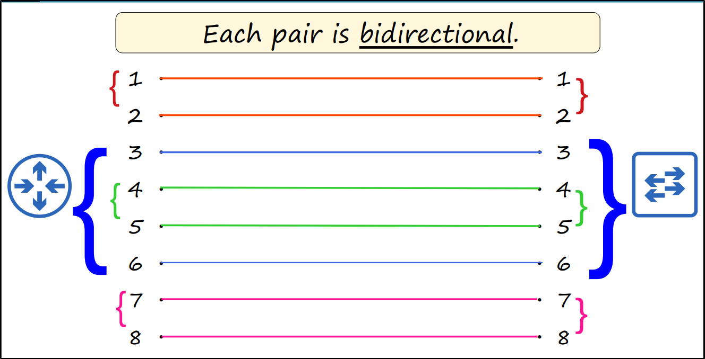

### **Bit & Bytes**
- Speed is measured in bits per second (Kbps, Mbps, Gbps, etc), not bytes per second

### **Ethernet**
- Ethernet is a collection of network protocols/standards.
- Ethernet standards are Defined in the IEEE 802.3 standard in 1983.
	(IEEE = Institute of Electrical and Electronics Engineers)

.png)

### **UTP Cables**
- UTP stands for Unshielded Twisted Pair
- Unshielded means that the wires have no metallic shield which can make them vulnerable to electrical interference
- The twist helps protect against electromagnetic interference or EMI
- there are 4 twisted pairs and 8 wires in total

- for 10BASE - T and 100BASE - T
	
	
	
	
	
	
	
	
	
	
	

- Newer networking devices have a feature called **Auto MDI-X**, it allows devices to automatically detect which pins their neighbor is transmitting data on and then adjust which pins they use to transmit and receive data 

- for 100BASE-T and 10GBASE-T
	- They use all 4 pairs (8 wires) to receive and transmit the data, Hence each pair is bidirectional
	

### **Fiber-Optic Connections**
-  The copper UTP cables use separate wires within the cable to transmit and receive data, the fiber optic cables instead use separate cables to transmit and receive like this

- It uses SPF (small Form-Factor Pluggable) Transceiver to connect to router or switch
- These cables send light over glass fibre.
- There are four parts/layers in the cable: (from centre to the outer layer)
	1) **The fibreglass core**: Light is transmitted down this core to transmit data from one device to another.
	2) **Cladding** that reflects light
	3) **a protective buffer** which protects the fibreglass from breaking
	4) the outer jacket of the cable

- Types of Fibre-optic cables
	
	- **Single mode fibre**: 
		- Core diameter is narrower than multimode fiber. 
		- Light enters at a single angle (mode) from a laser-based transmitter. 
		- Allows longer cables than both UTP and multimode fiber. 
		- More expensive than multimode fiber (due to more expensive laser-based SFP transmitters)
	- **Multi mode fibre**:
		- Core diameter is wider than single-mode fiber. 
		- Allows multiple angles (modes) of light waves to enter the fiberglass core. 
		- Allows longer cables than UTP, but shorter cables than single-mode fiber. 
		- Cheaper than single-mode fiber (due to cheaper LED-based SFP tranmitters).

