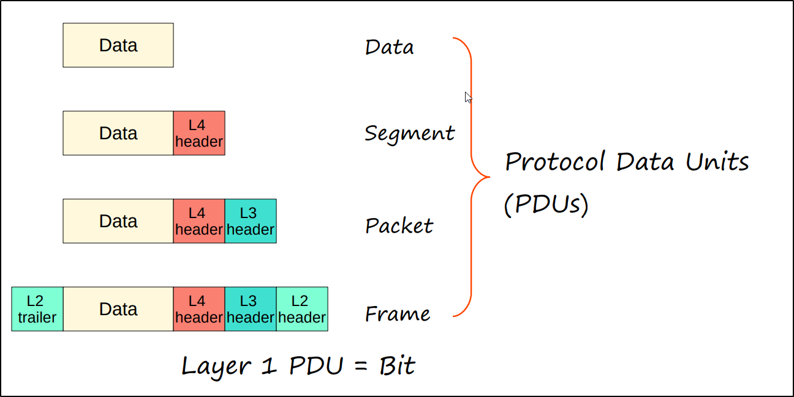

- **Network models** categorize and provide a structure for networking protocols and standards.
- **Protocols** is a set of rules defining how network devices and software should work.
### **OSI Model**
- ‘Open Systems Interconnection’ model 
- A conceptual model that categorizes and standardizes the different functions in a network.
- Created by the ‘International Organization for Standardization’ (ISO). 
- Functions are divided into 7 ‘Layers’. 
- These layers work together to make the network work

###### Application Layer
- This layer is closest to the end user. 
- Interacts with software applications, for example your web browser (Brave, Firefox, Chrome, etc.)
- HTTP and HTTPS are Layer 7 protocols (https://www.cisco.com)
- Keep in mind that Layer 7 doesn't include the application itself like Firefox or chrome, but rather the protocols that interact with the application like HTTP or HTTPS
- Functions of Layer 7 include: 
	- Identifying communication partners 
	- Synchronizing communication
 
 

- Both the Encapsulation and De-encapsulation processes are the example of adjacent layer interaction  (interaction between the different layer of OSI model)
- The communication between the application layers of the two different systems is called same layer interaction. 
- This same layer interaction between application layers is what allows the application layer to perform its functions of identifying communication patterns, synchronizing communications, etc

###### Presentation Layer
- Data in the application layer is in ‘application format’. 
- It needs to be ‘translated’ to a different format to be sent over the network. 
- The Presentation Layer’s job is to translate between application and network formats. 
- For example, encryption of data as it is sent, and decryption of data as it is received. 
- Also translates between different Application Layer formats to ensure that the data is in a format the receiving host can understand

###### Session Layer
- Controls dialogues (sessions) between communicating hosts. 
- Establishes, manages, and terminates connections between the local application (for example, your web browser) and the remote application (for example, YouTube).

---

- Network engineers don’t usually work with the top 3 layers. 
- Application developers work with the top layers of the OSI model to connect their applications over networks.

---

###### Transport layer
- The transport layer adds a header in front of the data
- It Segments and reassembles data for communications between end hosts. 
- meaning, it Breaks large pieces of data into smaller segments which can be more easily sent over the network and are less likely to cause transmission problems if errors occur.
- For example, if data wasn't segmented and you were trying to watch a video, if an error occured that prevented the video from reaching your computer, you wouldn't be able to watch the video at all. However, if the data is segmented into many small units and only one fails to reach the destination, that's not a big problem, the might skip for a second, but then will continue on just fine.
- Provide host-to-host communication.

###### Network Layer
- Provides connectivity between end hosts on different networks (ie. outside of the LAN). 
- Provides logical addressing (IP addresses). 
- Provides path selection between source and destination. 
- Routers operate at Layer 3.

###### Data Link
- Provides node-to-node connectivity and data transfer (for example, PC to switch, switch to router, router to router). 
- Defines how data is formatted for transmission over a physical medium (for example, copper UTP cables) 
- Detects and (possibly) corrects Physical Layer errors. 
- Uses Layer 2 addressing, separate from Layer 3 addressing. 
- Switches operate at Layer 2.

###### Physical Layer
- Defines physical characteristics of the medium used to transfer data between devices. 
- For example, voltage levels, maximum transmission distances, physical connectors, cable specifications, etc. 
- Digital bits are converted into electrical (for wired connections) or radio (for wireless connections) signals. 
- All of the information in Day 2’s video (cables, pin layouts, etc.) is related to the Physical Layer.

### **TCP/IP Suite**
- Conceptual model and set of communications protocols used in the Internet and other networks. 
- Known as TCP/IP because those are two of the foundational protocols in the suite. 
- Developed by the United States Department of Defense through DARPA (Defense Advanced Research Projects Agency) 
- Similar structure to the OSI Model, but with fewer layers. 
- This is the model actually in use in modern networks. 

`NOTE: The OSI model still influences how network engineers think and talk about networks.

