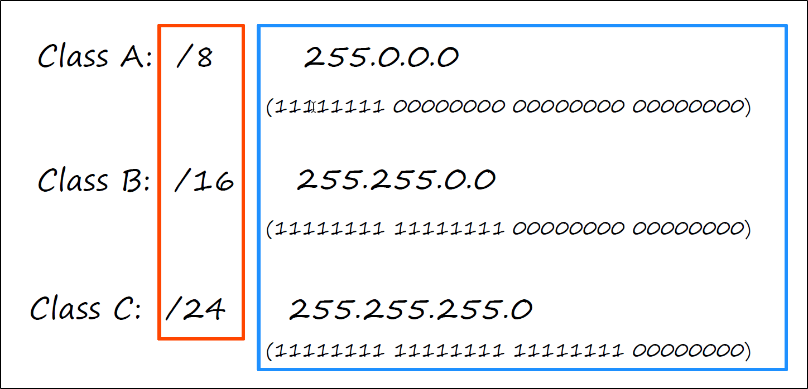

- IPv4 comes in Layer 3 

- IP addresses are 32 bits (4 bytes) in length
- 32 bit is divided into 4 * 8 , i.e., 4 octet of 8 bits each
- 8 bits are represented in form of 0's and 1's

- The end of the class A range is usually consider to be 126 
- The 127 range is reserved for ***loopback*** addresses
	- Address range 127.0.0.0 – 127.255.255.255
	- Used to test the ‘network stack’ (think OSI, TCP/IP model) on the
	   local device
	- If a device sends any network traffic to an address in this range, it is simply processed back up the TCP IP stack as if it were traffic received from another device.

- In class A there are fewer possible network addresses, however, because the network portion is very long there can be many host on each network
- Class C is opposite, there are may possible networks, but because the host portion is smaller, there are fewer hosts on each network

- Hosts on the same network will have the same network portion, but a unique host portion of their IP addresses

- The first address in each network is the network address, it can't be assigned to hosts, also the last address of the network is the broadcast address
- So the host count is 2 less. For example 254 in Class C

- If the Host portion of the IP address is all 0’s, it means it is the Network Address, the identifier of the network itself
- The network address CANNOT be assigned to a host. The network address is the first address of the network, but the first usable address is one above the network address.
- So the network address is the first address with the network portion of all zeroes. However, the last address in a network with a host portion of all 1's is the broadcast address for the network, So the last usable address is actually one under the broadcast address.
- So the broadcast address is the Layer 3 address used to send a packet to all hosts on the local network

- Maximum usable address in class C
	

- Maximum usable address in Class B
	

- maximum usable address in Class A
	

- Formula to find maximum usable address
	
