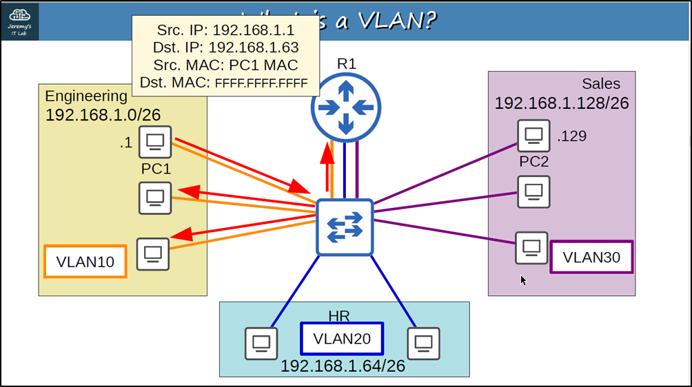
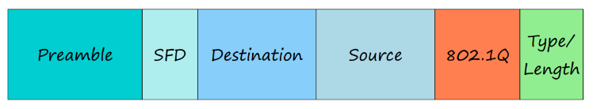

VLAN (part 1)

### **What is a LAN?**
- A LAN is a single **broadcast domain**, including all devices in that broadcast domain
- A **broadcast domain** is the group of devices which will receive a broadcast frame (destination MAC FFFF.FFFF.FFFF) sent by any one of the members.
- Broadcast frame = destination MAC FFFF.FFFF.FFFF

### **What is a VLAN?**
- **VLANs (Virtual LANs)** are logical grouping of devices in the same broadcast domain.
- VLANs can spread across multiple switches, with each VLAN being treated as its own subnet or broadcast domain. 
- This means that frames broadcasted onto the network will be switched only between the ports within the same VLAN.
- A VLAN acts like a physical LAN, but it allows hosts to be grouped together in the same broadcast domain even if they are not connected to the same switch.
- Here are the main reasons why VLANs are used:
	- VLANs reduce security risks by reducing the number of hosts that receive copies of frames that the switches flood.
	- you can keep hosts that hold sensitive data on a separate VLAN to improve security.
	- you can create more flexible network designs that group users by department instead of by physical location.
	- network changes are achieved with ease by just configuring a port into the appropriate VLAN.

- Let's say PC in Engineering dept. wants to send broadcast message to all PCs in it's dept. , but since it's a  broadcast message and switch is only aware up to layer 2 (It looks at layer two information like source and destination MAC addresses only.  It doesn't care about layer three, four, etc. So even though there are three separate subnets here).
- Here this is where VLANs comes in

- Although these pieces are all in the same LAN local area network, we can use VLANs or virtual local area networks to separate them at layer two.
- **How exactly do we assign these hosts to VLANs?**
	- We configure them on the switch.
	- More specifically on the switch interfaces, you configure the switch interface to be in a specific VLAN and then the end host connected to that interface is part of that VLAN.
	- The switch will consider each VLAN as a separate LAN and will not forward traffic between VLANs, including broadcast or unknown unicast traffic.
	- We configure them on the switch. More specifically on the switch interfaces, you configure the switch interface to be in a specific VLAN and then the end host connected to that interface is part of that VLAN. 
	- The switch will consider each VLAN as a separate LAN and will not forward traffic between VLANs, including broadcast or unknown unicast traffic.

- So if we have set up these VLANs, if PC 1 sends this broadcast frame after the frame arrives at the switch, it will be forwarded to all interfaces in the same VLAN. Because the broadcast arrived on an interface configured in VLAN ten the switch.

- The switch does not perform inter-VLAN routing. It must send the traffic through the router. 

### **VLAN Configuration**
- VLANs 1,1002-1005 exist by default and cannot be deleted.
- An **access port** is a switchport which belongs to a single VLAN, and usually connects to end hosts like PCs. This type of interface is configured on switch ports that are connected to end devices such as workstations, printers, or access point
- Switchports which carry multiple VLANs are called **trunk ports**.

---
---

VLAN (part 2)

- There is no link in VLAN20 between SW1 and SW2. This is because there are no PCs in VLAN20 connected to SW1. PCs in VLAN20 can still reach PCs connected to SW1, R1 will perform inter-VLAN routing
- Below image demonstrate how router will perform inter-VLAN routing
-   
- In a small network with few VLANs, it is possible to use a separate interface for each VLAN when connecting switches to switches, and switches to routers. 
- However, when the number of VLANs increases, this is not viable. It will result in wasted interfaces, and often routers won’t have enough interfaces for each VLAN.
- You can use trunk ports to carry traffic from multiple VLANs over a single interface

- Let's say this PC in vlan 10 wants to send some data to this other PC in VLAN 10. It sends the traffic to SW2, which then sends it to SW1.  
- Now here's a question: how does SW1 know which VLAN the traffic belongs to?
- Both VLANs 10 and 30 are allowed on the interface that traffic was received on.
- But how does the SW1 know which VLAN it belongs to?
- The answer is VLAN tagging
- Switches will ‘tag’ all frames that they send over a trunk link. This allows the receiving switch to know which VLAN the frame belongs to.
- Trunk ports = ‘tagged’ ports 
  Access ports = ‘untagged’ ports 
- frames sent over access ports aren't tagged. They don't need to be tagged because the interface belongs to a single VLAN.

### VLAN Tagging

- There are two main trunking protocols: ISL (Inter-Switch Link) and IEEE 802.1Q. 
- ISL is an old Cisco proprietary protocol created before the industry standard IEEE 802.1Q. 
- IEEE 802.1Q is an industry standard protocol created by the IEEE (Institute of Electrical and Electronics Engineers). 
- You will probably NEVER use ISL in the real world. Even modern Cisco equipment doesn’t support it. For the CCNA, you only need to learn 802.1Q

  

- The 802.1Q tag is inserted between the Source and Type/Length fields of the Ethernet frame. 
- The tag is 4 bytes (32 bits) in length. 

- The tag consists of two main fields: Tag Protocol Identifier (TPID) Tag Control Information (TCI) 
- The TCI consists of three sub-fields

- **TPID (Tag Protocol Identifier)**
	- 16 bits (2 bytes) in length 
	- Always set to a value of 0x8100. This indicates that the frame is 802.1Q-tagged.
	- 0x means hexadecimal, the actual value in the field is just 8100.
	- For hexadecimal digits, each hexadecimal digit is four bits, so four times four is 16.
	- Since the dot one Q tag comes after the source mark field of the Ethernet frame. This is where the type field is usually located.
	- When the switch sees this value of 8100 here, it knows it's a .1Q tagged frame.

- **PCP (Priority Code Point)** 
	-  3 bits in length 
	- Used for Class of Service (CoS), which prioritizes important traffic in congested networks. 

  
- **DEI (Drop Eligible Indicator)**  
	- 1 bit in length 
	-  Used to indicate frames that can be dropped if the network is congested

  
**- VID (VLAN ID)**  
	- 12 bits in length 
	-  Identifies the VLAN the frame belongs to. 
	- 12 bits in length = 4096 total VLANs (2^12), range of 0 - 4095 
	-  VLANs 0 and 4095 are reserved and can’t be used. Therefore, the actual range of VLANs is 1 – 4094 
	- Cisco’s proprietary ISL also has a VLAN range of 1 - 4094

- Now let’s see the diagram again

- So this PC and VLAN 10 wants to send traffic to this other PC in Vlan 10.
- The traffic goes to SW2, which then forwards it to SW1 with a tag indicating that the traffic belongs to VLAN 10. 
- SW1 receives the frame and because the destination is also in Vlan 10, it will forward the traffic to the destination.
- Remember, a standard layer two switch like this will only forward traffic in the same VLAN, it will not forward traffic between VLANs.

#### Native VLAN  
- 802.1Q has a feature called the native VLAN. (ISL does not have this feature)
- The native VLAN is VLAN 1 by default on all trunk ports, however this can be manually configured on each trunk port. 
	- It's important to remember that this has to be configured on each trunk port separately.
	- It's not a global configuration on the switch.
- The switch does not add an 802.1Q tag to frames in the native VLAN. 
	- It will forward the frame normally without adding the dot one Q tag to it.
- When a switch receives an untagged frame on a trunk port, it assumes the frame belongs to the native VLAN. It’s very important that the native VLAN matches! 

- When native VLAN matches

- When native VLAN not match

- When native VLAN mismatch and frame is also tagged with one of the VLAN in native VLAN

